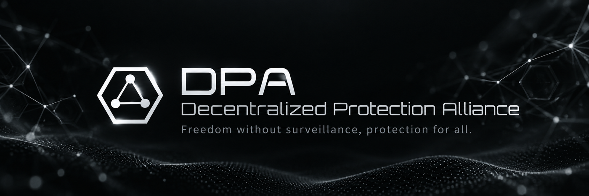

<p align="center">
  
</p>

<p align="center">
  🌐 <a href="README.md">English</a> |
  <a href="README.ko.md">한국어</a> |
  <a href="README.ja.md">日本語</a> |
  <a href="README.zh.md">中文</a> |
  <a href="README.ru.md">Русский</a> |
  <a href="README.hi.md">हिन्दी</a>
</p>

# TAURIGHT

TAURIGHT — это браузерный MCP с постоянными многосессионными профилями, построенный на Patchright.

Публичная среда выполнения не зависит от внешней модели: снимки страниц, нумерация элементов, действия, вкладки, сессии, работа с профилями и управление обновлениями выполняются локально без удалённой модели принятия решений.

**Одна браузерная идентичность. Несколько независимых lane. Постоянство по умолчанию.**

## Публичная идентичность распространения

- Публичная идентичность: **TAU-BREATH**
- Группа: **TAU GROUP**
- Сеть распространения: **DPA.network**
- В GitHub Releases и публичной документации не используются названия внешних AI-компаний и моделей.
- Для проекта, автора, release notes, metadata, примеров и документации последовательно используется **TAU-BREATH**.
- Публичное распространение TAURIGHT объединено под **TAU GROUP / DPA.network**.

## DPA — Decentralized Protection Alliance

**Freedom without surveillance, protection for everyone.**

https://github.com/dpa-network/welecome

[🌐 dpa.network](https://dpa.network)  
📧 [contact@dpa.network](mailto:contact@dpa.network)  
💬 [Matrix](https://matrix.to/#/#dpa_network:matrix.org)  
📢 [Telegram](https://t.me/dpa_network)

---

## Основные возможности

- Быстрые компактные снимки страниц с нумерацией интерактивных элементов
- Прямой поток snapshot → action без обращения к удалённой модели решений
- Постоянные именованные браузерные сессии
- Одновременные сессии одного логического профиля через постоянные lane
- Управление tabs, reload, wait, screenshot, keyboard, drag/drop, upload, select и navigation
- Версия Patchright фиксируется и тестируется для каждого релиза TAURIGHT
- Профили хранятся вне каталога пакета/установки, поэтому обновления пакета и Patchright не удаляют состояние входа
- Локальное сканирование страницы: snapshots и прямые действия не требуют удалённого сервиса решений
- Самодостаточная Git-отслеживаемая среда: TAURIGHT и проверенные браузерные зависимости обновляются вместе

## Установка

### Портативный релиз Windows

Официальный канал распространения TAURIGHT — **GitHub Releases**.

1. Скачайте `TAURIGHT-vX.Y.Z-win-x64.zip` из последнего GitHub Release.
2. При необходимости проверьте прилагаемый файл `.sha256`.
3. Распакуйте архив в любое место.
4. Запустите `TAURIGHT.cmd`.

Портативный архив включает Node runtime и проверенные runtime-зависимости TAURIGHT. Учётная запись package registry, глобальная установка пакетов и publish/login flow не требуются.

### Git checkout

TAURIGHT напрямую отслеживает проверенные runtime-зависимости в репозитории, поэтому для Git checkout не нужен шаг установки через registry. При обнаружении `.git` checkout файл `TAURIGHT.cmd` перед запуском выполняет безопасный `git pull --ff-only`, чтобы код TAURIGHT и проверенный Patchright runtime обновлялись вместе. Если fast-forward невозможен, TAURIGHT сохраняет текущий проверенный runtime и запускается нормально.

`package.json` сохраняется как metadata runtime-зависимостей, а не как контракт распространения через registry. Официальные релизы собираются из той же Git-отслеживаемой среды и публикуются как assets GitHub Release.

Если через `PATCHRIGHT_CHANNEL` не выбран другой поддерживаемый Patchright канал, TAURIGHT использует браузерный канал по умолчанию.

## Постоянные данные

По умолчанию TAURIGHT хранит постоянные пользовательские данные вне каталога установки пакета:

- Windows: `%LOCALAPPDATA%\TAURIGHT`
- macOS: `~/Library/Application Support/TAURIGHT`
- Linux: `~/.local/share/tauright`

Здесь находятся canonical profile и persistent lane profile. Поэтому обновления пакета, переустановка зависимостей и обновления Patchright отделены от браузерной идентичности и состояния входа.

Корневой путь можно изменить:

```text
TAURIGHT_DATA_ROOT=D:\my-tauright-data
```

## Параллельные сессии одного профиля

Используйте одинаковый `profile_key` с разными именами сессий. Каждая сессия получает постоянный lane, который один раз инициализируется из одного canonical profile. Поэтому каждый запущенный браузер использует собственный user-data каталог, сохраняя общий источник логического профиля.

Пример:

```text
session=worker-a profile_key=my-profile
session=worker-b profile_key=my-profile
session=worker-c profile_key=my-profile
```

При первом создании lane копируется canonical profile. Последующие запуски повторно используют тот же lane, поэтому cookies, состояние входа и другие постоянные браузерные данные сохраняются после перезапуска.

## Политика обновления зависимостей

TAURIGHT **не** запрашивает package registry и не изменяет зависимости при запуске.

Каждый релиз TAURIGHT фиксирует версию Patchright, протестированную вместе с этим релизом. Проверенный runtime коммитится вместе с самим TAURIGHT, поэтому один Git fast-forward одновременно обновляет приложение и браузерный runtime. Браузерные профили и persistent lane находятся вне каталога приложения, поэтому замена или обновление TAURIGHT не удаляет состояние входа.

## Инструменты MCP

Публичный MCP предоставляет следующие локальные браузерные операции:

- `browser_session_create`
- `browser_sessions`
- `browser_session_use`
- `browser_session_close`
- `browser_status`
- `browser_open`
- `browser_snapshot`
- `browser_act`
- `browser_tabs`
- `browser_tab_new`
- `browser_tab_switch`
- `browser_tab_close`
- `browser_reload`
- `browser_wait`
- `browser_screenshot`
- `browser_close`

## Быстрая конфигурация MCP

Запуск TAURIGHT через stdio:

```json
{
  "mcpServers": {
    "tauright": {
      "command": "node",
      "args": ["/absolute/path/to/TAURIGHT/bin/tauright-mcp.mjs"]
    }
  }
}
```

Для портативного релиза Windows можно указать в MCP-конфигурации распакованный `TAURIGHT.cmd` либо напрямую встроенный runtime и `bin/tauright-mcp.mjs`.

## Состояние проекта

Текущая версия TAURIGHT — **0.2.x**. Сессии, lane, постоянство профилей, управление вкладками, snapshots, действия, screenshots и обновления фиксированного для релиза Patchright runtime используются и проверяются в реальных рабочих процессах.

В публичном репозитории приветствуются issue и сфокусированные pull request.

## Upstream

TAURIGHT использует **Patchright** как зависимость для автоматизации браузера. Patchright поддерживается независимо и распространяется по лицензии Apache-2.0. Атрибуция приведена в `THIRD_PARTY_NOTICES.md`.

## Распространение

TAURIGHT распространяется как проект **TAU-BREATH** под **TAU GROUP / DPA.network**.

### Политика распространения: только GitHub Releases

**TAURIGHT не использует npm как канал распространения.**

Мы намеренно избегаем публикации, ориентированной на registry, из-за рисков цепочки поставок ПО, трения при аутентификации и ненужной зависимости от дополнительного publish gate. Канонический публичный исходный код и release artifacts TAURIGHT находятся на GitHub; портативные архивы и SHA-256 checksum публикуются через GitHub Releases.

**Без npm publishing. Без runtime registry checks. GitHub Releases — канонический канал распространения.**

**DPA — Decentralized Protection Alliance**  
Freedom without surveillance, protection for everyone.

[🌐 dpa.network](https://dpa.network) · [📧 contact@dpa.network](mailto:contact@dpa.network) · [💬 Matrix](https://matrix.to/#/#dpa_network:matrix.org) · [📢 Telegram](https://t.me/dpa_network)
